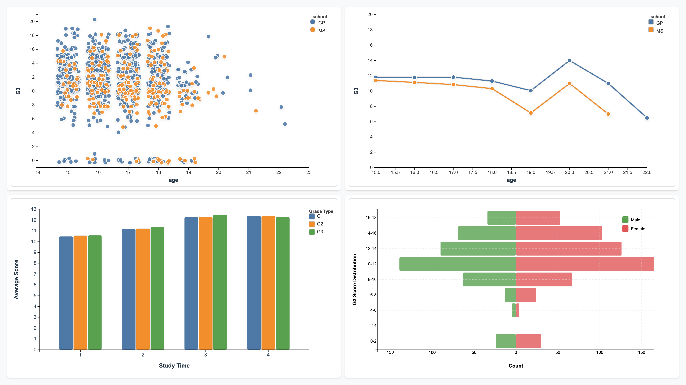
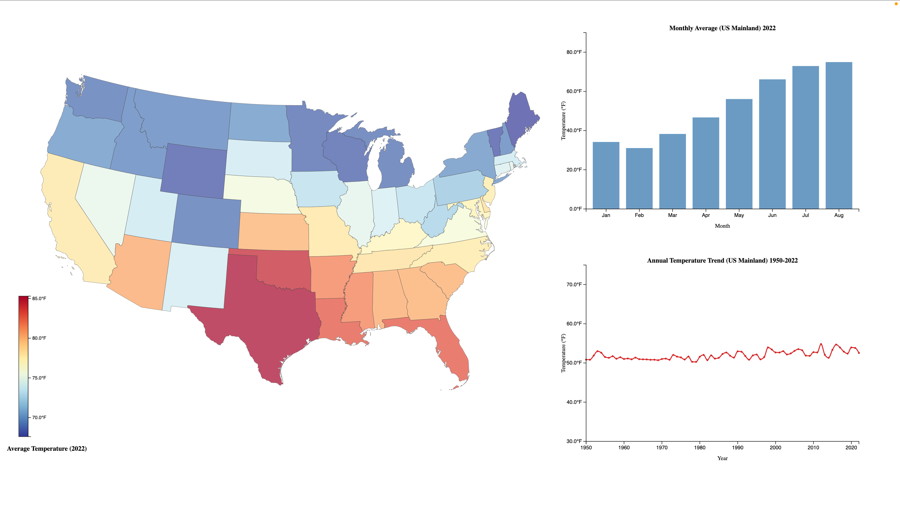
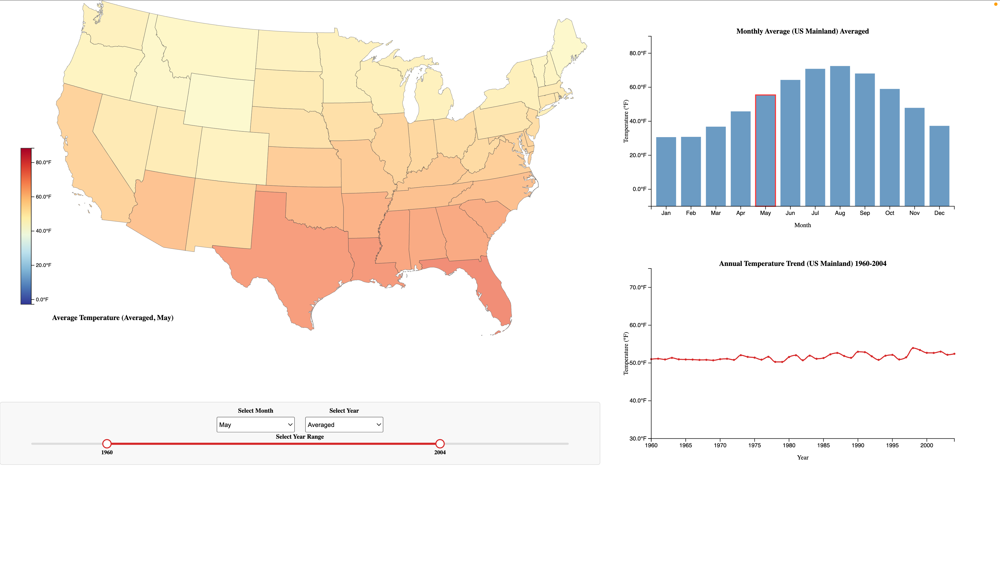
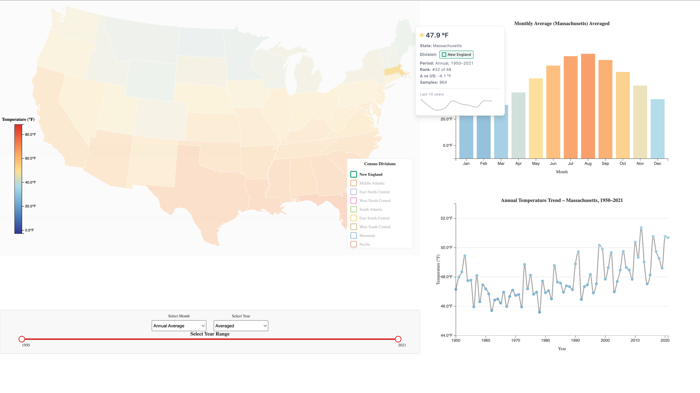

# Data Visualization Project

## Data

For this project, I propose to explore **three datasets** that represent different types of data and support diverse visualization methods:

1. **UCI Student Performance Dataset** ([link](https://archive.ics.uci.edu/dataset/320/student+performance)｜[VizHub](https://vizhub.com/TruthSeeker99/c6841e8ea18146ff802903d1281a03b1))  
   This dataset contains demographic information (gender, age, parental education), lifestyle factors (study time, alcohol consumption, family support), and academic records (grades G1, G2, and G3). It is widely used in educational data analysis and offers many opportunities to explore correlations and subgroup differences.  
   *(Replaces the earlier Car Sales dataset, which appeared simulated and less meaningful.)*

2. **Bitcoin OTC Trust Network** ([link](https://snap.stanford.edu/data/soc-sign-bitcoinotc.html)｜[VizHub](https://vizhub.com/TruthSeeker99/36f3100b5bb2451fa85607e1d4fa8e45))  
   This is a signed network dataset of user-to-user trust ratings. Each edge includes a source, target, rating (–10 to +10), and timestamp. It provides a rich context for analyzing social trust structures, network centrality, and dynamics over time.  

3. **Average Monthly Temperature by U.S. State (1950–2022)** ([source: NOAA/NCEI](https://www.ncei.noaa.gov/)｜[VizHub](https://vizhub.com/TruthSeeker99/cd3c792773ba4b99a39eac036358e1d9))  
   This dataset contains spatio-temporal climate information with monthly average temperatures for each U.S. state, along with latitude and longitude. It is suitable for geographic and temporal visualizations of climate change patterns.  

---

## Questions & Tasks

The following questions will drive the visualization and interaction designs:

**Student Performance**  
* How do grades vary across demographic factors (age, gender, school)?  
* Is there a correlation between study time and final performance (G3)?  
* How do early grades (G1, G2) relate to final outcomes (G3)?  

**Bitcoin OTC Trust Network**  
* Which users are the most trusted or distrusted in the network?  
* What structures emerge from positive vs. negative edges?  
* How does trust evolve over time?  

**U.S. Temperature**  
* How have average temperatures changed over time at the state level?  
* Which regions show the strongest warming trends?  
* Are there seasonal or geographic patterns in climate variation?  

---

## Sketches

I drafted sketch ideas for each dataset:

1. **Student Performance**  
   * Scatter plot: Age vs. final grade (G3), color by school.  
   * Line chart: Average G3 vs. age, split by school.  
   * Bar chart: Average scores (G1–G3) grouped by study time.  
   * Population pyramid: Male vs. female distribution of G3 scores.  

2. **Bitcoin OTC Trust Network**  
   * Force-directed network graph with nodes sized by in-degree trust and colored by average rating.  
   * Edge width encodes trust magnitude, and edge color encodes positive vs. negative ratings.  
   * Advanced idea: time slider to animate trust network evolution.  

3. **U.S. Temperature**  
   * Choropleth map of the U.S. with color encoding average monthly temperature.  
   * Line chart for each state’s temperature trend over time.  
   * Advanced idea: interactive time slider to animate climate changes from 1950–2022.  

---

## Prototypes

### Prototype 1: Student Performance Visualization ([VizHub](https://vizhub.com/TruthSeeker99/3be08474ddd14c40b5aaf770fd0d0f15))

I’ve created a first prototype visualization for the **Student Performance dataset**.  
It includes a scatter plot, line chart, grouped bar chart, and back-to-back bar chart (population pyramid), which address some of the core questions for this dataset.

Prototype screenshot:  

This prototype serves as an initial dashboard for **multi-dimensional data visualization**, combining four fundamental chart types to provide complementary perspectives on student performance.

#### Future Directions
- **Flexible chart replacement**: expand beyond the initial four chart types.  
- **Customizable attributes**: allow users to select which data fields to visualize.  
- **Interactive features**: enable cross-chart linking and coordinated highlighting for deeper exploration.

---

### Prototype 2.1: US Mainland Temperature Visualization (Revision) ([VizHub](https://vizhub.com/TruthSeeker99/6a8bece00ce94155a1b19fab1bb581df))

This is the **second version**, revised after **peer feedback**.  
The previous week’s version delivered the initial choropleth-and-charts visualization. In this update, I **validated the dataset** to include only the **continental U.S.**, and **removed regions without valid temperature records** to avoid misleading blanks.  
Additionally, I **added a legend** to clarify the color scale and temperature distribution.

Prototype screenshot:  

On top of the cleaned dataset, I implemented **interactive multi-chart coordination**: selecting a state displays that state’s **monthly average temperatures** and its **annual mean trend**.  
To ensure comparability across states and time, I **fixed the global min–max ranges** for both monthly and yearly axes.  
This improves cross-state consistency but slightly reduces the visibility of localized variations—something to refine later.

---

#### What’s new in this revision (layout & controls)

- **Unified control panel**: All time controls (Month + Year dropdowns and Year-Range slider) are consolidated into a single panel **below the map**, and the **panel’s bottom is aligned with the bottom of the line chart on the right** for a clean visual baseline.  
- **Consistent bindings**:  
  - **Month dropdown** drives the map (annual average by default; any month selectable).  
  - **Year dropdown** offers any single year **plus an “Averaged” option** (mean over the selected range).  
  - **Year-Range slider** limits the time window for the line chart and the “Averaged” computations.  
- **Stable scales**: Map legend range and chart axes remain fixed; only the rendered data slice changes.  
- **Bar-chart cue**: When a month is selected, the corresponding bar is **highlighted with a border** to reinforce the selection.

---

#### Future Directions
- **Responsiveness & layout polish**: tighter spacing, small-screen stack, and consistent label sizing.  
- **Interaction clarity**: hover tooltips with exact values and “Averaged over YYYY–YYYY” badges.  
- **Performance**: precompute yearly/monthly aggregates and debounce slider events.  
- **Analytics**: add “delta vs. long-term mean” and simple anomaly flags; optional regional grouping.  
- **Export & provenance**: snapshot current view (PNG/CSV) with parameter stamps for reproducibility.

---

### Prototype 2.2: US Mainland Temperature Visualization (Styling & Regional Update) ([VizHub](https://vizhub.com/TruthSeeker99/6a8bece00ce94155a1b19fab1bb581df))

This update focuses on **visual refinement**, **interaction clarity**, and the **first step toward geographic grouping**.

Prototype screenshot:  

---

#### What’s new in this revision (visual & interaction updates)

1. **Centralized style management**  
   All visual styles are now maintained in a dedicated **CSS file**, which controls color palettes, axis design, typography, and component layout.  
   This makes it easier to keep visual consistency across the map, bar chart, and trend line.

2. **Enhanced hover and selection interaction**  
   Added **tooltips** that appear on mouse hover, displaying detailed state-level temperature data.  
   Clicking a state **pins** the tooltip and highlights that state with a neutral gray outline for persistent inspection.  
   Hover and click interactions are now mutually exclusive to prevent duplicate tooltips.

3. **Introduction of regional grouping (U.S. Census Divisions)**  
   Each state is assigned to one of the **nine U.S. Census divisions**, as suggested by peer.  
   While the map still encodes temperature with color fill, the **detailed information panel displays the division name**.  
   A **passive legend** in the **bottom-right corner** shows all nine divisions; when a state is selected, its division row is highlighted and others fade for context.

---

#### Future Directions
1. **Division-level aggregation and comparison**  
   - Reflect selected state’s division with outline color.
   - Add region-wide statistics and boundary outlines for each division.  
   - Implement multi-state selection and division-level highlighting.

2. **State, region, and time integration**  
   - Develop an intuitive way to compare across **states, divisions, and temporal ranges** within the same dashboard.

3. **Student Performance visualization interactivity**  
   - Design and implement **interactive logic** for the student performance prototype to support brushing, filtering, and linked chart updates.

---

## Open Questions
* For categorical-heavy attributes in the student dataset, which encoding best avoids overlap and ensures readability?  
* For the trust network, how best to visualize large graphs without losing clarity?  
* For the temperature map, what design adjustments could emphasize subtle seasonal patterns without sacrificing comparability — e.g., adaptive scaling or small multiples by month?  

---

## Milestones

* **Week 1–2**: Clean and preprocess all three datasets. Create static plots for Student Performance.  
* **Week 3–4**: Build interactive prototype for Student Performance. Start Bitcoin network visualization.  
* **Week 5–6**: Add U.S. Temperature spatio-temporal visualization with time slider.  
* **Week 7 (Final)**: Polish all visualizations into one interactive portfolio piece. Prepare final video presentation.  
