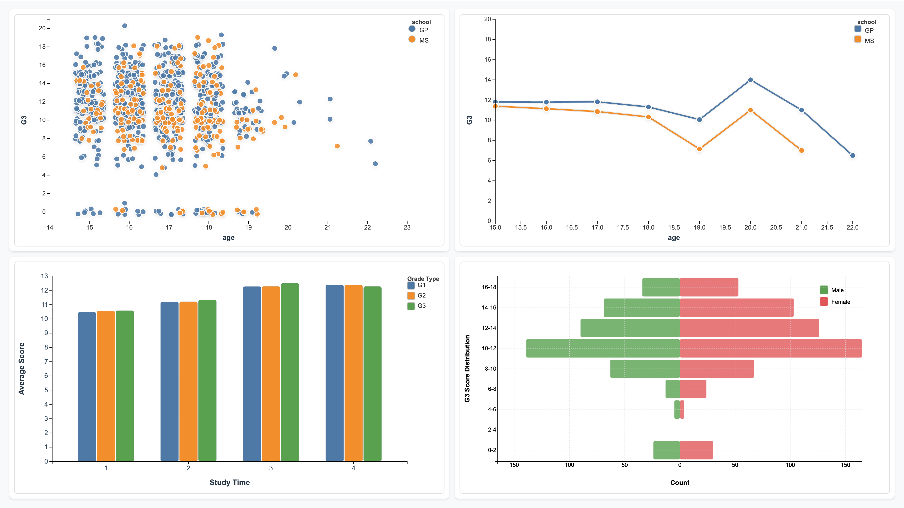
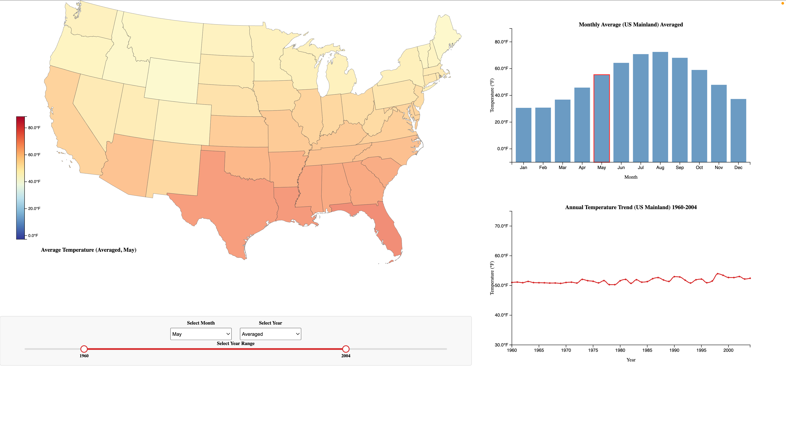
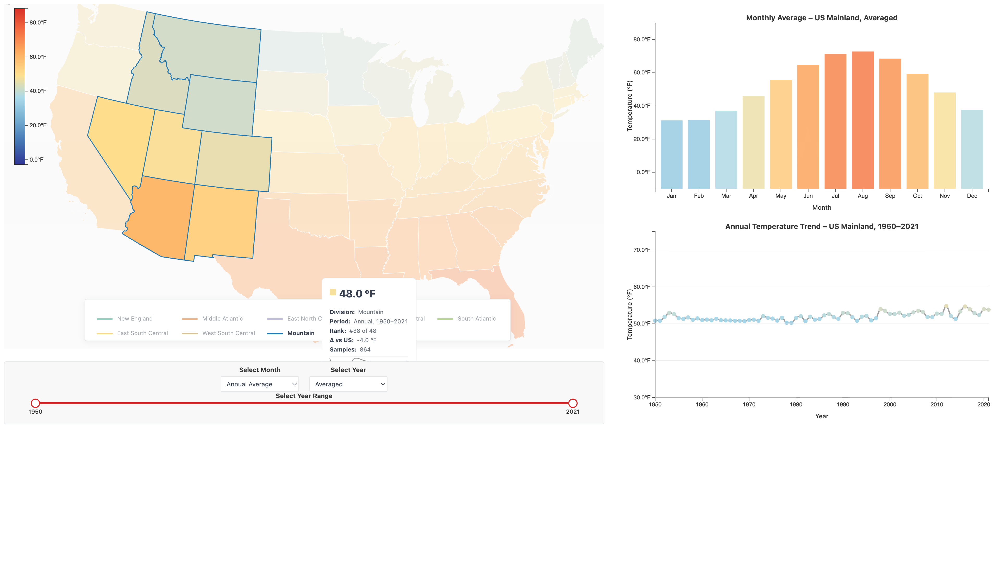
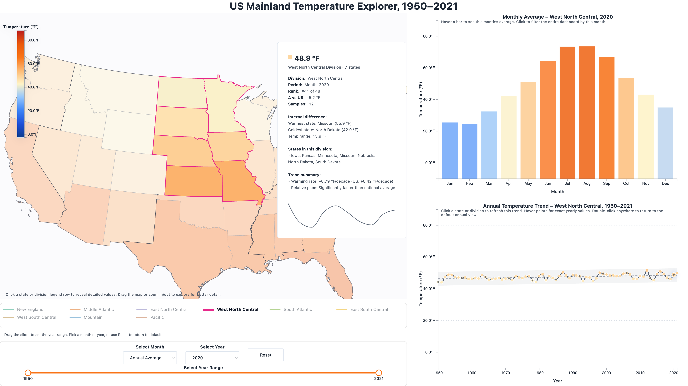

# Data Visualization Project

## Data

For this project, I propose to explore **three datasets** that represent different types of data and support diverse visualization methods:

1. **UCI Student Performance Dataset** ([link](https://archive.ics.uci.edu/dataset/320/student+performance)｜[VizHub](https://vizhub.com/TruthSeeker99/c6841e8ea18146ff802903d1281a03b1))  
   This dataset contains demographic information (gender, age, parental education), lifestyle factors (study time, alcohol consumption, family support), and academic records (grades G1, G2, and G3). It is widely used in educational data analysis and offers many opportunities to explore correlations and subgroup differences.  
   *(Replaces the earlier Car Sales dataset, which appeared simulated and less meaningful.)*

2. **Bitcoin OTC Trust Network** ([link](https://snap.stanford.edu/data/soc-sign-bitcoinotc.html)｜[VizHub](https://vizhub.com/TruthSeeker99/36f3100b5bb2451fa85607e1d4fa8e45))  
   This is a signed network dataset of user-to-user trust ratings. Each edge includes a source, target, rating (–10 to +10), and timestamp. It provides a rich context for analyzing social trust structures, network centrality, and dynamics over time.  

3. **Average Monthly Temperature by U.S. State (1950–2022)** ([source: NOAA/NCEI](https://www.ncei.noaa.gov/)｜[VizHub](https://vizhub.com/TruthSeeker99/cd3c792773ba4b99a39eac036358e1d9))  
   This dataset contains spatio-temporal climate information with monthly average temperatures for each U.S. state, along with latitude and longitude. It is suitable for geographic and temporal visualizations of climate change patterns.  

---

## Questions & Tasks

The following questions will drive the visualization and interaction designs:

**Student Performance**  
* How do grades vary across demographic factors (age, gender, school)?  
* Is there a correlation between study time and final performance (G3)?  
* How do early grades (G1, G2) relate to final outcomes (G3)?  

**Bitcoin OTC Trust Network**  
* Which users are the most trusted or distrusted in the network?  
* What structures emerge from positive vs. negative edges?  
* How does trust evolve over time?  

**U.S. Temperature**  
* How have average temperatures changed over time at the state level?  
* Which regions show the strongest warming trends?  
* Are there seasonal or geographic patterns in climate variation?  

---

## Sketches

I drafted sketch ideas for each dataset:

1. **Student Performance**  
   * Scatter plot: Age vs. final grade (G3), color by school.  
   * Line chart: Average G3 vs. age, split by school.  
   * Bar chart: Average scores (G1–G3) grouped by study time.  
   * Population pyramid: Male vs. female distribution of G3 scores.  

2. **Bitcoin OTC Trust Network**  
   * Force-directed network graph with nodes sized by in-degree trust and colored by average rating.  
   * Edge width encodes trust magnitude, and edge color encodes positive vs. negative ratings.  
   * Advanced idea: time slider to animate trust network evolution.  

3. **U.S. Temperature**  
   * Choropleth map of the U.S. with color encoding average monthly temperature.  
   * Line chart for each state’s temperature trend over time.  
   * Advanced idea: interactive time slider to animate climate changes from 1950–2022.  

---

## Prototypes

### Prototype 1: Student Performance Visualization ([VizHub](https://vizhub.com/TruthSeeker99/3be08474ddd14c40b5aaf770fd0d0f15))

I first built a dashboard for the **Student Performance dataset**.  
It includes a scatter plot, line chart, grouped bar chart, and back-to-back bar charts to explore:

- how study habits and family background relate to grades,
- how distributions change across schools and genders,
- how multiple charts can be linked through shared brushing and filtering.

Prototype screenshot:  

This prototype established basic multi-view coordination patterns, but the rest of the report focuses on the more complex **U.S. temperature** dashboard.

---

### Prototype 2.1: US Mainland Temperature – Cleaned Data & Baseline View ([VizHub](https://vizhub.com/TruthSeeker99/6a8bece00ce94155a1b19fab1bb581df))

The first temperature prototype targeted:

- **Data validation & cleaning**
  - Filtered the dataset to **continental U.S. states** only.
  - Removed states/regions without valid temperature records to avoid misleading blank areas.
  - Established consistent annual and monthly aggregates for each state.

- **Baseline visualization**
  - A **choropleth map** colored by annual or monthly average temperature.
  - A **monthly bar chart** and **annual trend line** for the U.S. mainland.
  - A global diverging color scale from cool blues to warm oranges/reds.

- **Fixed global ranges**
  - Both monthly and yearly charts use **shared min–max ranges** to make cross-state comparisons meaningful over time.

This prototype proved that the dataset could support a coherent spatial–temporal dashboard, but the time controls and layout were still fragmented.

---

### Prototype 2.2: US Mainland Temperature – Layout & Unified Controls ([VizHub](https://vizhub.com/TruthSeeker99/6a8bece00ce94155a1b19fab1bb581df))

In the next iteration, I focused on **layout and controls**, which is the part that was previously buried under “What’s new in this revision (layout & controls)” and is now promoted to its own prototype.

Key changes:

- **Unified control panel (bottom of the dashboard)**  
  All time-related controls were moved into a single panel:
  - **Select Month** dropdown:  
    - `Annual Average` (default view).  
    - `January … December` (specific months).
  - **Select Year** dropdown:  
    - `Averaged` (mean over the selected year range).  
    - Individual years (1950–2021).
  - **Select Year Range** slider:  
    - Defines the year window used both for the line chart and for `Averaged` computations.

- **Consistent bindings**
  - **Map** is always driven by (Month, Year / Averaged, Year Range).  
  - **Monthly bar chart** shows the selected region’s seasonal cycle.  
  - **Annual trend chart** shows the corresponding annual series using the same global y-axis.

- **Stable scales**
  - Legend and chart axes are **fixed in numeric range**; only data slices change.
  - Selecting month or year does not rescale axes, improving comparability.

Example control panel view:  

This prototype transformed the map + charts into a **well-structured, time-control-driven dashboard**.

---

### Prototype 2.3: US Mainland Temperature – Styling & Interaction Clarity ([VizHub](https://vizhub.com/TruthSeeker99/8a01251225e949428b316b31def1a4fd))

This revision emphasized **visual polish** and **interaction clarity**:

- Improved typography, spacing, and color consistency across map and charts.
- Sharpened labels and legend design to make the temperature encoding more legible.
- Adjusted hover styles and highlighted states to avoid ambiguity about what is currently selected.
- Prepared the layout to accommodate future regional grouping and detail panels.

Prototype screenshot:  

At this stage, the dashboard looked much more like a finished product, but the internal architecture was still a mix of ad-hoc DOM manipulation and D3 logic.

---

### Prototype 2.4 & 2.5: US Mainland Temperature – Refactor & D3-Centric Architecture ([VizHub](https://vizhub.com/TruthSeeker99/8a01251225e949428b316b31def1a4fd))

Prototypes 2.4 and 2.5 focused on **structural reorganization** and **D3 unification**.

Major work in 2.4:

- **Codebase refactor**
  - Extracted repeated logic into reusable modules.
  - Reduced deeply nested update paths that had accumulated during earlier AI-assisted patches.
  - Cleaned up legacy assumptions that made the code fragile and hard to reason about.

- **D3-centered rendering**
  - Migrated remaining ad-hoc DOM manipulation to proper D3 data joins and update patterns.
  - Clarified how data flows from the processed dataset into each chart.
  - Improved performance and stability by avoiding redundant recalculation and unnecessary DOM work.

This stage did not dramatically change the visual appearance but laid the **foundation for reliable interaction and future extensions**.

---

### Prototype 2.6: US Mainland Temperature – Division Integration ([VizHub](https://vizhub.com/TruthSeeker99/8a01251225e949428b316b31def1a4fd))

The next step was to introduce **Census divisions** as first-class citizens without breaking the state-centric core logic.

Key changes:

- **Division as an extended selection mode**
  - Divisions are treated as a **multi-state extension** of the existing selection model.
  - Single-state selection remains the primary focus; division selection is implemented on top of it rather than as a separate pathway.

- **Division-aware legend and outlines**
  - Each division gets a unique stroke color and label.
  - Selecting a division (via legend) outlines its member states and fades others.
  - The selection state is reflected consistently across map, charts, and detail panel.

- **Shared data structures**
  - Division-level aggregates reuse the **same structures** as states and national averages:
    - no custom one-off arrays,
    - no parallel pipelines.
  - This keeps the architecture coherent and minimizes the risk of divergence between state vs. division logic.

Prototype screenshot:  

This prototype made division-level comparison possible while preserving the cleanliness of the refactored architecture.

---

### Prototype 2.7: US Mainland Temperature – Final Coordinated Dashboard ([VizHub](https://vizhub.com/TruthSeeker99/8a01251225e949428b316b31def1a4fd))

Final screenshot:  

The final revision turns the temperature visualization into a **fully coordinated, division-aware, month-aware dashboard**, and serves as the **final version** for the course (no further “next steps” are planned).

New and consolidated features:

- **Division-aware state outlines & passive legend**
  - Single-state selection:
    - The selected state gets a thick outline in its division’s color.
    - Other states stay visible but slightly de-emphasized.
  - Division selection via legend:
    - All states in that division are outlined.
    - Non-division states are faded.
  - The legend itself:
    - Highlights the active division row (bold, full opacity).
    - Shows others at reduced opacity.
    - Acts as a **passive cue** rather than an aggressive control panel.

- **State & division detail cards**
  - Clicking a state or division shows a card with:
    - Name and type (state / division / US Mainland),
    - period summary (annual vs. month, year range),
    - rank among states,
    - difference vs. US Mainland,
    - sample count.
  - Cards are positioned:
    - strictly inside the map region,
    - never covering the division legend,
    - adjusted to avoid covering the selected region.

- **Tight coordination between map, monthly bars, and annual trend**
  - **Monthly bar chart**
    - Hover: `{Month}: {value}°F`.
    - Click: sets `Select Month` and updates map + trend chart.
    - Double-click: resets to `Annual Average`.
  - **Annual trend chart**
    - Mode:
      - `Annual Average` → annual mean per year.
      - Specific month → that month’s mean per year.
    - Hover: `{Year}: {value}°F` (+ region name when not mainland).
    - Click: sets `Select Year` to that year (single-year slice).
    - Double-click: resets `Select Year` to `Averaged`.
  - **Control panel**
    - Still the single source of truth for month, year, and year range.
    - Now synchronized in both directions with the right-hand charts.

- **Trendline and confidence band**
  - For each current series, a **light dashed regression line** is drawn.
  - A **very subtle CI band** using ±3σ of residuals gives a sense of long-term trend variability.
  - Trendline and CI recompute whenever the month, range, or region changes.

- **Unified temperature encoding**
  - Map, bars, and trendline all use the **same temperature color scale**.
  - Monthly and annual modes share a consistent y-axis range for direct visual comparison.

- **Hover tooltips and annotations**
  - Tooltips on both right-hand charts include boundary checks, so they never leave the chart area.
  - All hints (map instructions, chart captions, control-panel explanations) are defined centrally and automatically wrapped to fit chart widths.

This prototype consolidates all previous work into a **clean, robust, and interpretable final dashboard**.

---

## Final Dashboard – Visual Design & Interaction Logic

This section describes the final system from a **viewer’s perspective**: what the charts encode, how they interact, and what kinds of questions the dashboard supports.

### 1 Layout Overview

The dashboard is composed of:

1. **Left:** US Mainland choropleth map  
2. **Right top:** Monthly average bar chart  
3. **Right bottom:** Annual temperature trend chart  
4. **Bottom:** Unified control panel and division legend  

Together, they support:

- spatial comparison across states and divisions,
- temporal exploration across months and years,
- smooth transition between overview and detailed views.

---

### 2 Map – Spatial Overview & Entry Point

**Encoding**

- Each state is filled with a color representing its **average temperature**, under the current:
  - month mode (`Annual Average` vs. specific month),
  - year mode (`Averaged` over slider range vs. specific year).

- A neutral base outline separates states; a **division-colored outline** is applied for selection.

**Interaction**

- Click a **state**:
  - Highlights the state with a division-colored outline.
  - Slightly fades other states.
  - Updates the right-hand charts and detail card to this state.

- Click a **division legend row**:
  - Outlines all states in that division.
  - Fades non-division states.
  - Updates charts and card to division-level aggregates.

- Click empty map / double-click in charts:
  - Clears selection and returns to **US Mainland** as the reference.

**Detail card**

- Shows:
  - region name & type,
  - period (month/annual, year or range),
  - rank among states,
  - Δ vs. U.S. mainland,
  - sample count.
- Always placed within the map area and away from the legend.

The map provides a **geographically grounded overview** and an intuitive starting point for region-level questions.

---

### 3 Division Legend – Mode Awareness

The division legend serves as both a **status indicator** and **selection shortcut**:

- Each row:
  - a stroke-colored swatch matching the division outline,
  - the division name,
  - bold + full opacity when active, otherwise faded.
- Clicking a row:
  - activates division mode and drives all linked views.

This makes the “state vs. division” distinction visible at all times without adding another heavy control panel.

---

### 4 Monthly Bar Chart – Seasonal Pattern

The monthly bar chart answers:  
**“What does the seasonal temperature cycle look like for this region?”**

- X-axis: January–December  
- Y-axis: temperature (same range as the trend chart)  
- Bars: height encodes monthly mean temperature for the current region.

**Interaction**

- Hover: `{Month}: {value}°F`.  
- Click:
  - updates `Select Month`,
  - drives the map and trend chart to that month.
- Double-click:
  - resets to `Annual Average`.

This view reveals **seasonal highs and lows** and serves as a **direct controller** of the month dimension.

---

### 5 Annual Trend Chart – Long-term Dynamics

The trend chart answers:  
**“How has this region’s temperature evolved over decades?”**

- X-axis: years (constrained by the slider).  
- Y-axis: temperature in °F (shared with bar chart).  
- Series:
  - annual mean temperature per year, or
  - a single month’s temperature per year when a month is selected.

**Visual layers**

1. Data points (and optional connecting line).  
2. Linear regression trendline (light dashed).  
3. ±3σ CI band (very faint background).

**Interaction**

- Hover: `{Year}: {value}°F` + region name when appropriate.  
- Click a point:
  - sets `Select Year` to that year, effectively “zooming into” a specific year.
- Double-click:
  - resets back to `Averaged`.

The chart allows users to spot **long-term warming patterns** and **specific anomalous years**, while the trendline provides a gentle summary without overpowering the raw data.

---

### 6 Control Panel – Explicit Time & Reset Model

The control panel makes the time model **explicit and reversible**:

- **Select Month**
  - `Annual Average` or any specific month.
- **Select Year**
  - `Averaged` or any specific year.
- **Select Year Range** slider
  - sets the range used for `Averaged` and for the trend chart domain.
- **Reset**
  - clears month/year/state/division selections and returns to the global baseline.

Short text below the panel explains this behavior in plain language.

---

### 7 Annotations & UX Hints

All annotations are centralized in a configuration object and rendered with **automatic line wrapping**:

- Map hint: what clicking a state/division does.  
- Monthly hint: what the bars represent and how click/hover behave.  
- Trend hint: how to read the series and how click/double-click change the view.  
- Control-panel hint: summarizes slider, dropdowns, and reset semantics.

This reduces reliance on external documentation and makes the dashboard largely **self-explanatory**.
